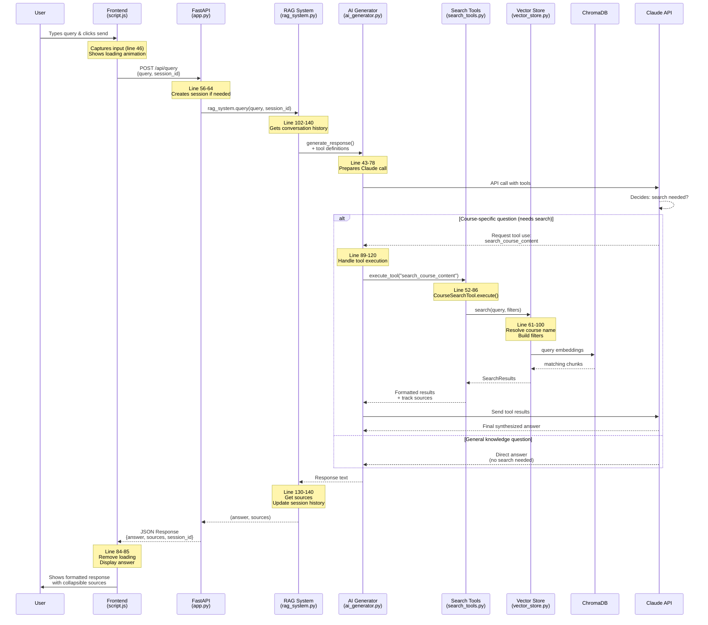

# RAG System Query Processing Flow

## Key Components

### 1. **Frontend Layer**
- **script.js**: Handles UI interactions, sends requests, displays responses

### 2. **API Layer** 
- **app.py**: FastAPI server, handles HTTP endpoints, session management

### 3. **RAG Orchestration**
- **rag_system.py**: Coordinates between components, manages conversation flow

### 4. **AI Processing**
- **ai_generator.py**: Interfaces with Claude API, handles tool execution

### 5. **Search System**
- **search_tools.py**: Implements search tool interface for Claude
- **vector_store.py**: Manages ChromaDB vector operations

### 6. **Storage**
- **ChromaDB**: Vector database for semantic search
- **Session Manager**: Maintains conversation history

## Flow Summary

1. **User Input** → Frontend captures query
2. **API Request** → Frontend sends POST to `/api/query`
3. **RAG Processing** → System orchestrates the query
4. **AI Decision** → Claude decides if search is needed
5. **Vector Search** → If needed, semantic search in ChromaDB
6. **Response Generation** → Claude synthesizes final answer
7. **Display** → Frontend shows response with sources

## Key Features

- **Smart Search**: Claude decides when to search vs. answer directly
- **Semantic Matching**: Course names resolved semantically
- **Context Preservation**: Session history maintained
- **Source Attribution**: Tracks and displays content sources
- **Tool-based Architecture**: Extensible tool system for Claude